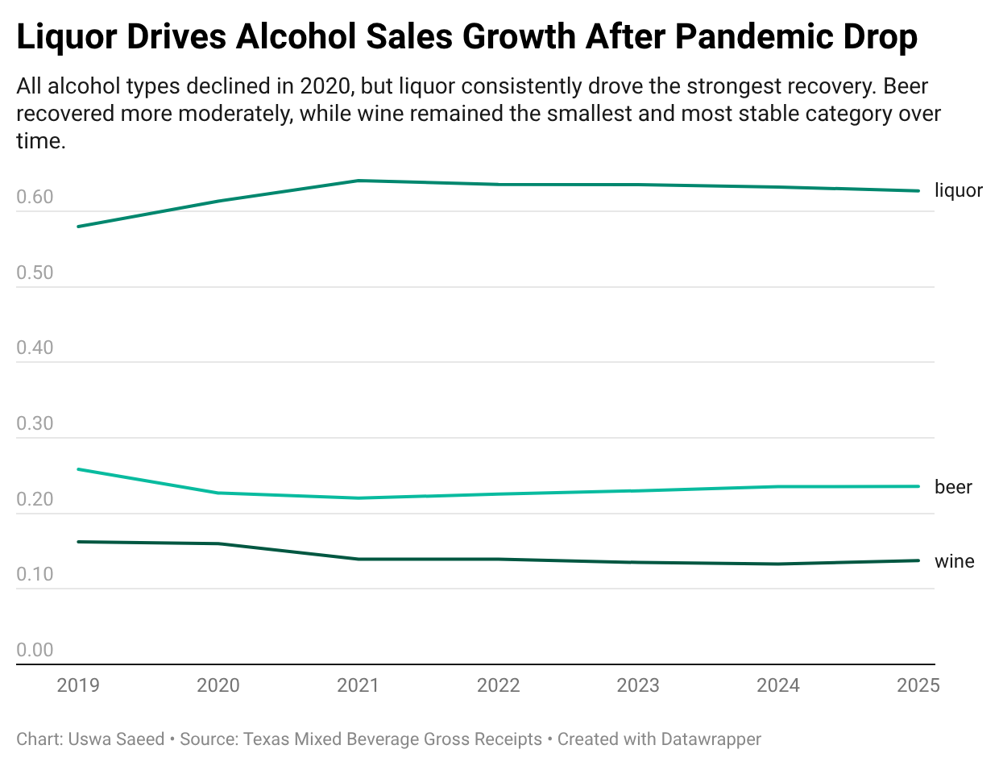
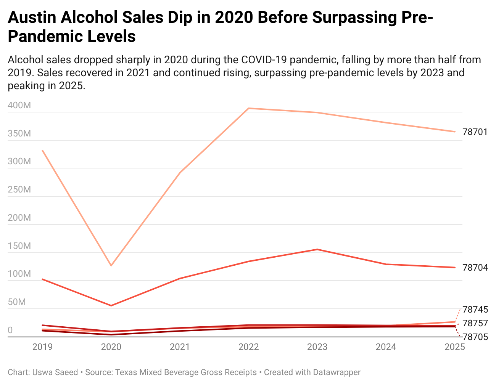

## Project description

Alcohol sales in Austin fell sharply during the COVID-19 pandemic in 2020 but recovered unevenly across neighborhoods, alcohol types and business establishments. Using Texas mixed beverage data, this project examines how total sales changed over time and how recovery differed across ZIP codes, drink categories and individual establishments.

This final project works to answer the question: How did COVID-19 affect alcohol sales in Austin, and how did recovery vary by neighborhood, alcohol type and establishment growth?

## Summary

Austin’s alcohol sales plunged by more than half during the first year of the COVID-19 pandemic before surging to record highs by 2025, according to state tax data from the Texas Comptroller of Public Accounts. The rebound, however, was uneven, with major differences across neighborhoods, drink types and individual establishments.

Sales fell from about $883 million in 2019 to roughly $426 million in 2020 as pandemic restrictions and reduced in-person dining greatly disrupted bars and restaurants. The market rebounded in 2021 and continued to grow steadily in the following years, surpassing $1.14 billion by 2025.

The recovery varied by alcohol type. Liquor consistently accounted for the largest share of revenue throughout the period and drove much of the post-pandemic growth. Beer followed a similar but smaller recovery pattern, while wine remained the smallest and most stable category over time. By 2025, liquor made up the majority share of alcohol sales in Austin, increasing its dominance after the initial pandemic decline.

Geography also played a major role in how recovery unfolded. Central Austin ZIP codes, including 78701, saw some of the sharpest early declines and a slower rebound compared with other areas. In contrast, several suburban and fast-growing ZIP codes more than doubled their pre-pandemic sales by 2025, reflecting stronger long-term gains outside of urban areas.

At the business level, recovery was uneven as well. Many businesses experienced steep losses in 2020, but a smaller group not only recovered but went on to surpass their pre-pandemic sales by wide margins. This suggests that post-COVID growth was driven in part by expansion among high-performing venues rather than equal recovery across all establishments.

This data was taken from  the Texas Mixed Beverage Gross Receipts [dataset](https://data.texas.gov/dataset/Mixed-Beverage-Gross-Receipts/naix-2893), a statewide reporting system that tracks monthly tax filings from bars and restaurants required to report alcohol sales under Texas law. The dataset includes more than 3.7 million records and captures beer, wine and liquor receipts by business location. For this analysis, only Austin-area establishments were examined to measure how alcohol sales changed before, during and after the pandemic.

Sales in Austin have not just recovered but expanded since the pandemic. That growth, however, has been uneven across the city, with gains concentrated in specific areas, categories and establishments.

